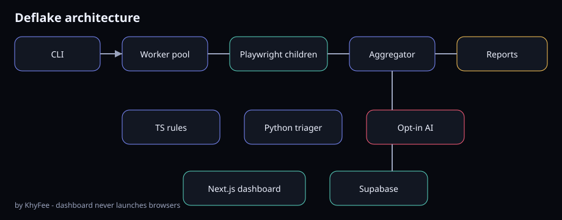

<div align="center">

# Deflake

**Catch flaky Playwright tests before they gaslight your CI.**

Parallel isolated retries · Wilson stats · evidence packs · optional AI (redacted only)

[](https://github.com/KhyFee/Deflake/actions/workflows/ci.yml)
[](https://github.com/KhyFee/Deflake/actions/workflows/codeql.yml)
[](LICENSE)
[](package.json)
[](https://playwright.dev)
[](CONTRIBUTING.md)
[](https://github.com/KhyFee/Deflake)

**One command proves the flake** (local demo — no keys, no DB, no cloud):

```bash
git clone https://github.com/KhyFee/Deflake.git
cd Deflake && npm install && npm run demo
# exit 2 = flake detected → open .deflake/runs/
```

[Architecture](docs/architecture.svg) · [Contributing](CONTRIBUTING.md) · [Security](SECURITY.md) · [Demo scripts](docs/demo-scripts.md)

</div>

---

## Why Deflake?

| Pain | What people usually do | What Deflake does |
|------|------------------------|-------------------|
| CI fails once, passes on re-run | “Re-run” and hope | **N isolated attempts** in parallel |
| “Is it flaky or broken?” | Gut feel | **Wilson confidence** + stable/flake/fail buckets |
| Flakes die with zero context | Screenshot somewhere | **Markdown / HTML / JUnit / SARIF** evidence packs |
| AI fixes that invent secrets | Paste full traces | **AI opt-in only**, redacted evidence, never auto-patches |

Built for Playwright teams who are tired of green-on-retry green.

---

## 60-second demo

```bash
git clone https://github.com/KhyFee/Deflake.git
cd Deflake
npm install
npm run demo
```

Expect **exit code 2** when the intentional flaky suite is detected. Artifacts land under `.deflake/runs/`.

Zero-config: works without Python, AI keys, or a database. Those only **enhance** output when present.

> **npm package:** the monorepo ships `@khyfee/deflake` as a workspace package. Public `npm i -g @khyfee/deflake` is **not published yet** — use the clone path above. Star the repo if you want npm packaging prioritized.

---

## Use on your Playwright project

From the monorepo after `npm install && npm run build` (or wire your path to the CLI):

```bash
# in your app with Playwright tests
npx tsx path/to/Deflake/packages/cli/src/cli.ts init
npx tsx path/to/Deflake/packages/cli/src/cli.ts doctor
npx tsx path/to/Deflake/packages/cli/src/cli.ts run --grep "checkout" --attempts 10
```

Workspace package name after build: `@khyfee/deflake` (`deflake` bin in `packages/cli`).

### Exit codes (CI-friendly)

| Code | Meaning |
|------|---------|
| `0` | Stable pass |
| `1` | Stable (deterministic) fail |
| `2` | Flake detected (or inconclusive with `--fail-on-flake`) |
| `3` | Config / runtime error |

Wire `demo` or `run` into GitHub Actions and treat **2** as the signal your suite is lying.

---

## Commands

| Command | Purpose |
|---------|---------|
| `init` | Write `deflake.config.json` |
| `check` / `doctor` | Environment diagnostics |
| `list` | Discover tests |
| `run` | Parallel attempts → summary + artifacts |
| `report` / `compare` | Regenerate or diff runs |
| `upload` | Idempotent dashboard ingest |
| `demo` | Seeded intentional flake fixture |

---

## Architecture



1. **CLI workers** launch isolated Playwright children  
2. **TypeScript aggregation** + reporters (md / html / junit / sarif / github summary)  
3. **Optional Python** offline triage  
4. **Optional Next.js dashboard** — stores signed results; **never** runs browsers  

Privacy defaults:

- Argv arrays only (no shell string execution)  
- Secrets redacted before disk / dashboard / AI  
- AI requires `DEFLAKE_AI=1` and **never auto-applies patches**  
- Supabase RLS when you turn the dashboard on  

---

## Dashboard (optional)

```bash
npm install
npm run build
npm run dev -w @deflake/web
```

Open `/demo` for seeded UI. `POST /api/v1/runs` accepts Bearer project tokens.

---

## Monorepo layout

| Path | Role |
|------|------|
| `packages/cli` | `@khyfee/deflake` |
| `packages/core` | Pool, stats, fingerprints, rules |
| `packages/reporters` | md / html / junit / sarif / github |
| `packages/triager` | Optional Python offline triage |
| `apps/web` | Next.js dashboard |
| `fixtures/*` | Intentional flaky + stable suites |
| `supabase/` | Auth / RLS schema |
| `docker/` | Playwright + triager images |

---

## Who this is for

- Teams fighting **flakes that only show up under load or rare races**  
- OSS maintainers who want **evidence-backed triage** before blaming the contributor  
- Interview / portfolio demos: one command that **proves** intermittent failure math  

Not for: reinventing Playwright itself, or “just increase `retries: 3` forever” without understanding.

---

## Roadmap (visible)

- [ ] Publish `@khyfee/deflake` to npm (`npx deflake demo` zero-clone)
- [ ] One-click GitHub Action wrapper
- [ ] Public demo video / GIF of flaky-suite detection
- [ ] More fixture patterns (timing, order, network)

Open an [issue](https://github.com/KhyFee/Deflake/issues) if you want one of these first.

---

## Contributing

See [CONTRIBUTING.md](CONTRIBUTING.md). Default branch is `main`. PRs with a failing/flake fixture + a green path are favorites.

## License

MIT © [KhyFee](https://github.com/KhyFee)

---

<div align="center">

If Deflake saves you from a flaky CI rabbit hole, **star the repo** so other teams can find it — and open an issue with the flake that still hurts.

[⭐ Star Deflake](https://github.com/KhyFee/Deflake) · [Profile](https://github.com/KhyFee)

</div>
